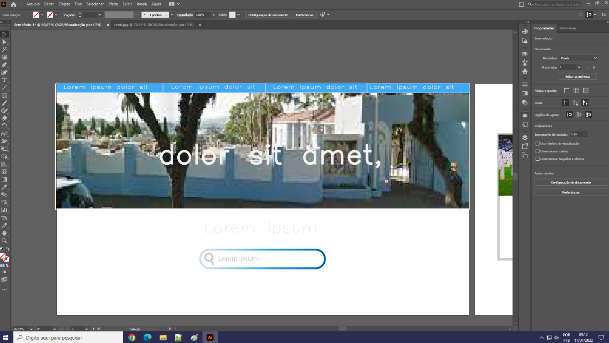
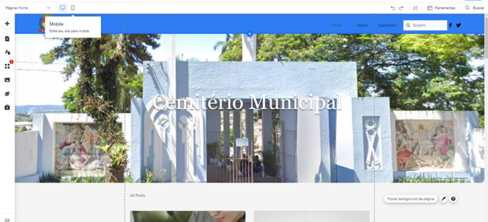
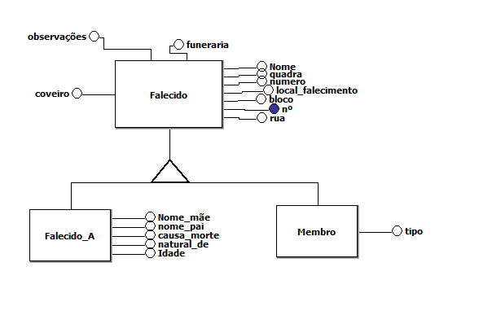

# Diário de bordo - Abril

## Semana 1 - 04/04 a 08/04

* Planejamento da Interface;

---

## Semana 2 - 11/04 a 15/04

* Debate e definicao da Linguagem a ser utilizada (PHP), no código e no Site;

---

## Semana 3 - 18/04 a 22/04

* Recesso das Aulas;

---

## Semana 4 - 25/04 a 29/04

* Simulado do Projeto no Banco de Dados;

