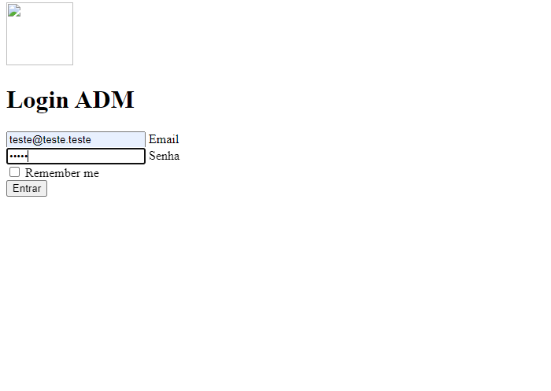

# Diário de bordo - Agosto

## Semana 1 - 01/08 - 05/08
- Atualização da Página GitHub;
- Teste e finalização do protótipo da página de login;

#### *Página de login:*

## Semana 2 - 08/08 - 12/08
- Revisões e atuaçlizações de Progressos e localizações de dúvidas e dificuldades; 

## Semana 3 - 15/08 - 19/08
- Ida da equipe ao Cemitério Municipal de Itaiba;
- Reunião com a Equipe da Prefeitura para retirada de dúvidas, pedidos de materiais e planejamento do projeto em relação ao Banco de Dados;

## Semana 4 - 22/08 - 26/08
- Correção de textos para garantir um melhor registro do Desenvolvimento do projeto;
- Correções necessárias para a apresentação do Projeto na BRAGANTEC;

## Semana 5 - 29/08 - 02/09

