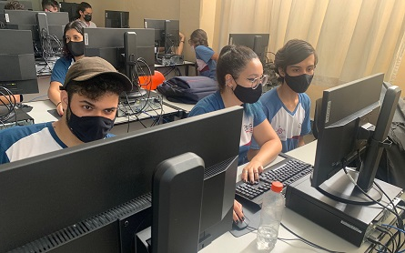
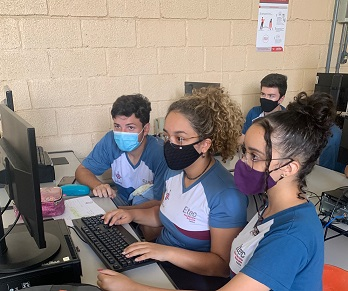
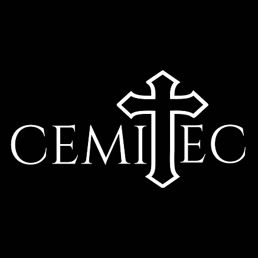

# Diário de bordo - Fevereiro

## **Semana 1 - 07/02 a 11/02**

- Discussão sobre quem seriam os membros da Equipe;
- Definição dos membros da equipe;
- Discussão sobre o Tema .
________

## **Semana 2 - 14/02 a 18/02**

- Análise da proposta de tema enviada pela Prefeitura Municipal de Itatiba;
- Aceitação do tema pela equipe;
- Definição do tema;
- Divisão da equipe em: desenvolvimento e documentação;
- Escolhe do nome equipe: CEMITEC.

### Membros da Equipe CEMITEC:

#### *Equipe de Desenvolvimento :*

#### *Equipe de Documentação :*

___

## **Semana 3 - 21/02 a 25/02**

- Definição das tecnologias usadas (linguagens de programação, banco de dados, interface gráfica, etc.) e levantamento técnico ;

### Tecnologias:  

- [MySQL](https://www.techtudo.com.br/noticias/2012/04/o-que-e-e-como-usar-o-mysql.ghtml)

Para programar o site escolhemos para o banco de dados esse software por conta de ter ligação com a escolha da linguagem do back-end. 

- [Python](https://www.python.org/about/)

No caso, a linguagem escolhida foi essa por é uma linguagem muito conhecida e bem enxuta, além de que se trata de uma linguagem que já temos um conhecimento prévio, o que torna mais “fácil” sua utilização. 

- [Django](https://www.djangoproject.com/)

Para ajudar na programação do back-end, usaremos este framework.

- [HTML, CSS e JavaScript](https://www.alura.com.br/artigos/html-css-e-js-definicoes)

Para programar o front-end, essas foram nossas escolhas por já termos conhecimento prévio dessas linguagens que são usadas prioritariamente para esse tipo de programa. 

- Pesquisa e análise das informações acerca do tema enviadas pela Prefeitura;
- Criação da conta e postagens de arquivos no GitHub.

___

## **Semana 4 - 28/02 a 04/03**

- Criação da página no GitHub;

- Criação da LOGO da Equipe:  

- Criação do site no GitHub:
- [Site CEMITEC](https://analusg.github.io/ProjetoTCC/) 
