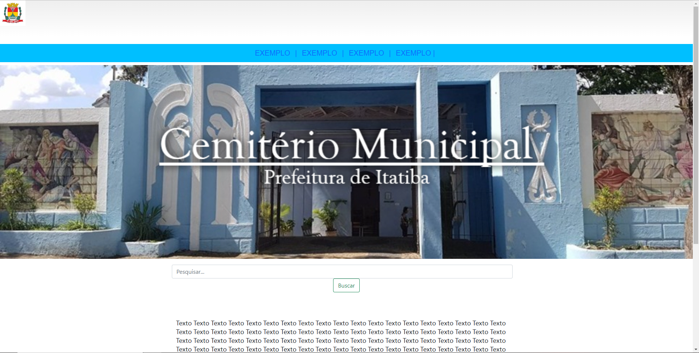
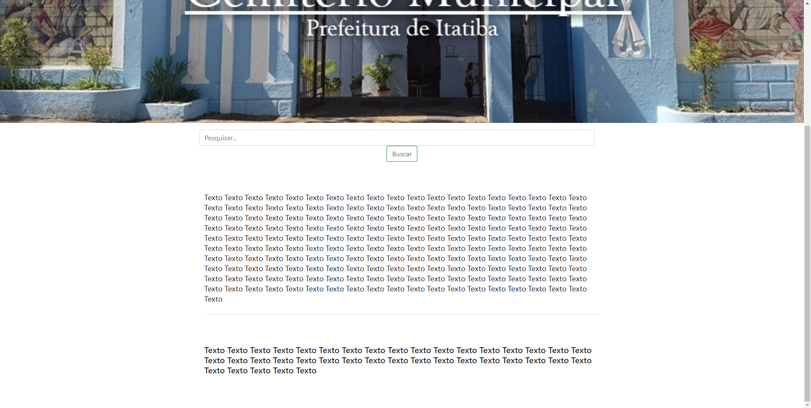

# Diário de bordo - Maio

## Semana 1 - 02/05 a 06/05

* Análise das Perguntas e Respostas feitas na Reunião com a Prefeitura de Itatiba;
* Listagem das Interfaces necessárias que precisam ser desenvolvidas para o site até o final do projeto;

---

## Semana 2 - 09/05 a 13/05

* Desenvolvimento dos primeiros códigos da tela inicial;
* Definição de alguns aspectos de melhoria e dúvidas a serem levadas para a Prefeitura, solucionar, e assim evoluirmos o Projeto;
* Leitura e pesquisas de Artigos referente ao tema e desenvolvimento do projeto;
* Desenvolvimento da primeira versão da Introdução do Artigo Científico;

---

## Semana 3 - 16/05 a 20/05

* Organização da documentação no GitHub;
* Finalização da Introdução;
* Continuação do desenvolvimento da interface do site (que será o oficial);
* Início do funcionamento do site;
* Conversa e esclarecimento de dúvidas via email com a área responsável pelo assunto na Prefeitura.

    

---

   

---

## Semana 4 - 23/05 a 27/05

* Revisão e complemento da Justificativa da escolha do tema;
* Leitura de artigos e busca por referências;
* Entrega da última versão da Justificativa.

[Diario Maio](https://github.com/AnaLuSG/ProjetoTCC/blob/main/diario_de_bordo/maio.md)
